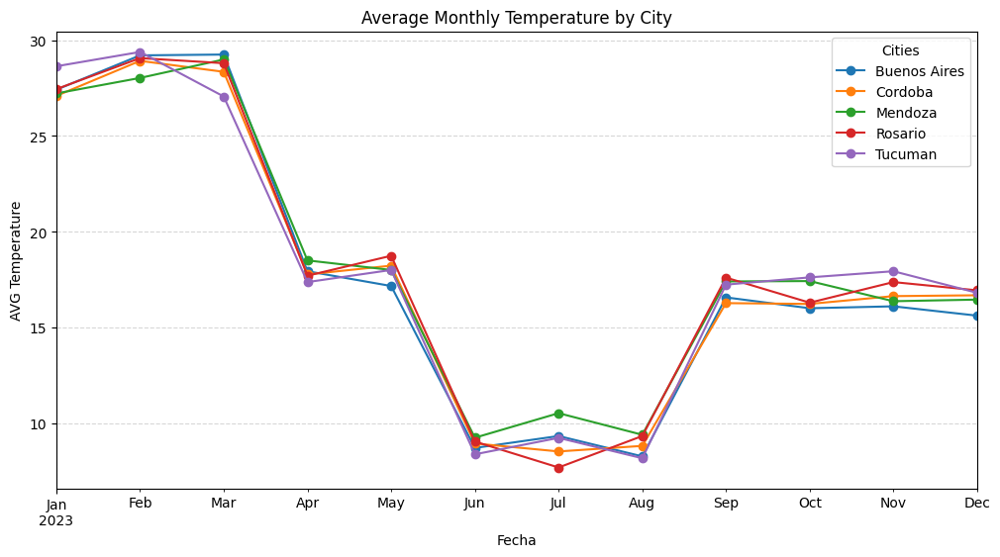
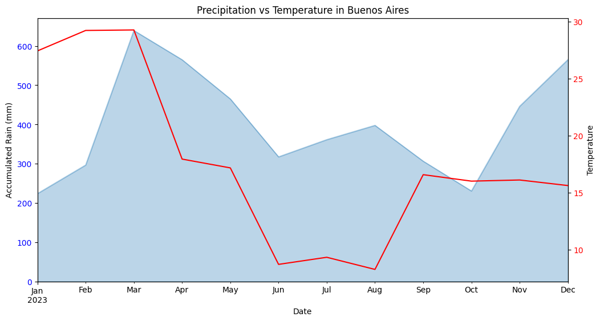
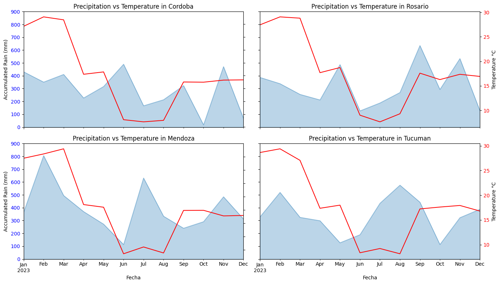

# Weather Temperature Analysis

## Project Overview
This project analyzes temperature and precipitation patterns across several cities in Argentina.

## Dataset
The dataset contains monthly temperature and precipitation data for multiple Argentine cities during 2023–2024.

## Dataset Preview

| Fecha         | Ciudad      | Temp_Max | Temp_Min | Precipitacion | Velocidad del Viento | Humedad Relativa|
|---------------|-------------|----------|----------|---------------|----------------------|-----------------|
| 2023-01-01    | Buenos Aires| 27       | 18       | 0.0           | 22.7                 | 68.8            |
| 2023-01-01    | Cordoba     | 35       | 18       | 0.0           | 33.8                 | 61.7            |
| 2023-01-01    | Tucuman     | 36       | 21       | 17.2          | 25.7                 | 54.9            |


## Tools
- Python
- Pandas
- Matplotlib
- Jupyter Notebook


## Analysis Questions

- Which city has the highest average temperature?
- How do temperatures vary across seasons?
- Which city records the highest precipitation?
- Are there differences between 2023 and 2024 temperatures?

## Project Structure

```text

weather-temperature-analysis
│
├── data
│   └── temperature_data_arg_2023.csv
│
├── images
│   └── average_min_temperature_by_city.png
│   └── average_max_temperature_by_city.png
│   └── average_monthly_temperatures_by_city.png
│   └── monthly_precipitation_by_city.png
│   └── precipitation_vs_temperature_in_buenos_aires.png
│   └── precipitation_vs_temperatures_in_cordoba_rosario_mendoza_and_tucuman.png
│   └── temperature_throughout_months
│   └── total_precipitation_by_city.png
│
├── notebook
│   └── weather_temperature_analysis.ipynb
│
└── README.md
```
## Key Insights
- Mendoza shows the highest average temperatures among the analyzed cities.
- A clear seasonal pattern is observed. Temperatures decrease between June and September, which corresponds to winter in the Southern Hemisphere
- Average temperatures in 2024 appear to be lower than those in 2023 by approximately 10°C in some months. Further analysis would be required to determine the cause of this variation.
- In Buenos Aires, the highest precipitation levels were recorded in March, when temperatures were also relatively high. This suggests that rainfall may be more frequent during the summer months, although some precipitation increases were also observed during winter.
- Córdoba and Rosario: They have very similar behaviors (which makes sense due to their geographical proximity), with significant rainfall in the transition months (autumn/spring).
- Tucumán and Mendoza: In Mendoza, rainfall increases significantly (around 800 mm) during the summer, coinciding with the heat. In contrast, Tucumán experiences little rainfall during the warmer months. A more in-depth analysis is needed to determine the source of this pattern.

## Visualizations






## How to Run the Project

1. Clone the repository

git clone https://github.com/Jefferson8841/weather-temperature-analysis.git

2. Install dependencies

pip install pandas matplotlib jupyter

3. Open the notebook

jupyter notebook
